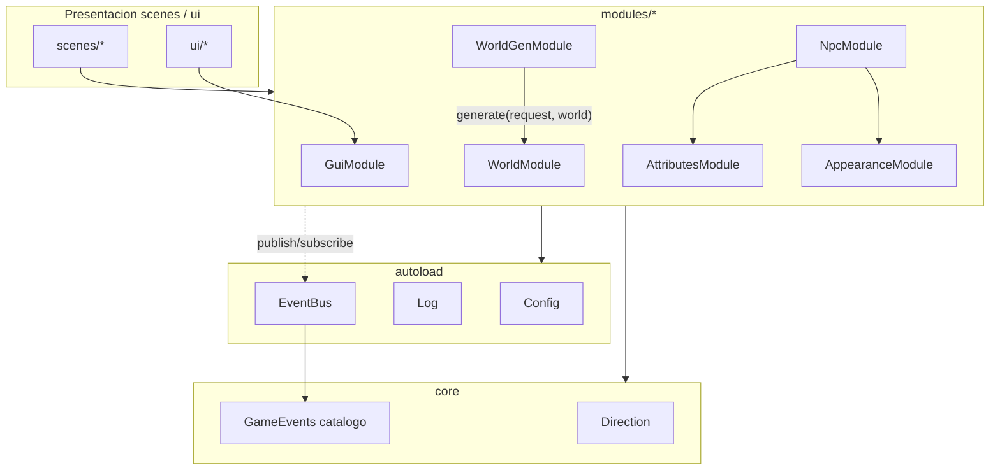

## Arquitectura: contratos, dependencias y backlog

Objetivo: convertir la arquitectura documentada en algo verificable y con la "cola" (EventBus + contratos) que hoy falta, sin tocar logica de juego. Todo lo que requiera refactor de gameplay queda en un backlog documentado.

### Alcance confirmado

- Cimientos seguros: EventBus funcional, fachadas finas `AppearanceModule`/`AttributesModule` (sin logica nueva de juego), catalogo de eventos, matriz de dependencias en docs/reglas.
- Validacion automatica de dependencias (lint) ampliando el arsenal de `tools/`.
- Doc de backlog con TODOs pendientes segun lo documentado.
- NO se refactoriza gameplay (`main_character_controller.gd`, `world_demo.gd` no cambian su logica).

### Grafo de dependencias objetivo

Reglas de arista (a validar por lint):

- `scenes`/`ui` -> `modules` (API publica), `core`, `autoload`. Prohibido `_private/` ajeno.
- `modules` -> `core`, `autoload`, API publica de otros `modules`, y `EventBus`. Prohibido `_private/` ajeno y prohibido `scenes`/`ui` (salvo allowlist).
- `core` -> `autoload` (minimo). `autoload` no depende de `modules`.
- Excepcion documentada temporal: `npc` -> `res://scenes/npc/npc_base.tscn` (allowlist), con TODO para inyectarla.

### 1. Catalogo de eventos (core)

Nuevo `core/events.gd` con `class_name GameEvents`: constantes `StringName` de canales y doc del payload por evento. Ejemplos iniciales:

- `world.generated` -> `{ region: Rect2i, seed: int }`
- `npc.spawned` -> `{ uid: int, archetype_id: StringName, cell: Vector3i }`

Vive en `core` para que emisores y suscriptores compartan el contrato sin acoplarse entre modulos.

### 2. EventBus (autoload)

Nuevo `autoload/event_bus.gd` (`extends Node`, `@tool` no necesario):

- API: `publish(event: StringName, payload: Dictionary = {})`, `subscribe(event, callable)`, `unsubscribe(event, callable)`.
- Implementacion con `add_user_signal`/`emit_signal` pre-registrando los canales de `GameEvents`.
- Traza por `Log` con codigo nuevo `EVT` (nivel 1 resumen, 2 detalle por listener).
- Registro en `project.godot` autoload: `EventBus="*res://autoload/event_bus.gd"`.
- Gate en `venv.ini`: `LOG_EVENTBUS_LEVEL=1`.
- Alta en `autoload/log.gd` `_MODULE_KEYS`: `"EVT": "EVENTBUS"`.

Primeros publishers reales (wiring de modulo, no gameplay):

- [modules/world_gen/world_gen.gd](modules/world_gen/world_gen.gd) `generate()` -> `EventBus.publish(GameEvents.WORLD_GENERATED, ...)`.
- [modules/npc/npc.gd](modules/npc/npc.gd) `spawn()` -> `EventBus.publish(GameEvents.NPC_SPAWNED, ...)`.

### 3. Fachada AttributesModule

Nuevo `modules/attributes/attributes.gd` (`class_name AttributesModule`) que centraliza el ciclo de vida de stats para que `npc` no conozca internals de `NpcVitals`:

- `static func spawn_vitals(template: VitalsTemplate) -> NpcVitals` (envuelve `NpcVitals.from_template`).
- `static func clone_attributes(set: AttributeSet) -> AttributeSet`.

Adopcion (dentro del dominio, sin gameplay): [modules/npc/npc_instance_data.gd](modules/npc/npc_instance_data.gd) `apply_archetype()` usa `AttributesModule` en vez de llamar directo a `NpcVitals.from_template` y clonar a mano.

### 4. Fachada AppearanceModule

Nuevo `modules/appearance/appearance.gd` (`class_name AppearanceModule`) que encapsula localizar y accionar el `NpcAppearanceController` para eliminar el acoplamiento por ruta de nodo (`"MotionPivot/Appearance"`):

- `static func find_controller(body: Node) -> NpcAppearanceController`
- `static func build_rig(body: Node, archetype: NpcArchetype) -> void`
- `static func set_orientation(body: Node, orientation: StringName) -> void`
- `static func set_moving(body: Node, moving: bool) -> void`

Adopcion solo module-internal: [modules/npc/npc_body.gd](modules/npc/npc_body.gd) usa `AppearanceModule` en `_apply()` en vez de `get_node("MotionPivot/Appearance")`. La adopcion en `main_character_controller.gd` (gameplay) queda como TODO de backlog.

### 5. Lint de arquitectura (validacion automatica)

Nuevo `tools/check_architecture.gd` (`extends SceneTree`, headless):

- Escanea `res://modules/**/*.gd`: si referencia `res://modules/<otro>/_private/` con `<otro>` distinto al modulo propio -> FAIL.
- Escanea `res://scenes`, `res://ui`, `res://addons`: si importan cualquier `modules/*/_private/` -> FAIL.
- Escanea `res://modules`: referencias a `res://scenes/` o `res://ui/` no incluidas en allowlist -> FAIL (allowlist inicial: `res://scenes/npc/npc_base.tscn`).
- Salida `OK:`/`FAIL:` por regla y `quit(1)` si hay violaciones.
- Uso: `godot --headless --path . --script res://tools/check_architecture.gd`.

Ademas, anadir los scripts nuevos a los `_PATHS` de [tools/validate_scripts.gd](tools/validate_scripts.gd) (chequeo de sintaxis).

### 6. Documentacion

Actualizar [docs/ARCHITECTURE.md](docs/ARCHITECTURE.md):

- Seccion 4: anadir matriz explicita de dependencias permitidas/prohibidas por capa (en bullets) y la excepcion allowlist de `npc`.
- Seccion 6: desarrollar el contrato de EventBus (catalogo en `core/events.gd`, payload por evento, publish/subscribe, gate `EVT`).
- Anadir patron "modulo Resource-only" (p. ej. datos de attributes) como forma valida de modulo.
- Seccion 12: registrar `EventBus` (EVT), `AppearanceModule` y `AttributesModule` como fachadas; nota del lint `tools/check_architecture.gd`.

Actualizar [docs/GAME_DESIGN.md](docs/GAME_DESIGN.md) solo si procede: referencia cruzada a eventos de dominio para spawn (`npc.spawned`).

### 7. Reglas Cursor

- Actualizar [.cursor/rules/module-api.mdc](.cursor/rules/module-api.mdc): resumen de matriz de dependencias, regla de no referenciar `scenes/`/`ui/` desde modulos (salvo allowlist), patron Resource-only, y mencion al lint.
- Nueva `.cursor/rules/events.mdc`: contrato de comunicacion via EventBus + catalogo `GameEvents` + gate de log.
- Actualizar [.cursor/rules/architecture-reference.mdc](.cursor/rules/architecture-reference.mdc): paso obligatorio de correr el lint al anadir/mover modulos.
- Actualizar [.cursor/rules/logging.mdc](.cursor/rules/logging.mdc): alta del codigo `EVT`.

### 8. Backlog documentado

Nuevo `docs/ROADMAP.md` con checklist agrupado (derivado de ARCHITECTURE 12 y GAME_DESIGN 12):

- Modulos pendientes: `grid` (AStarGrid2D + reglas z), `player`, `faction`, `equipment`, `status`, `combat`.
- Contratos pendientes: tablas de spawn `world_gen -> npc`, `SpawnPoint`, contrato de persistencia formal de `WorldModule` (hoy el editor toca `height_field`/`tile_catalog` directo).
- Refactors pendientes: extraer `player` desde `main_character_controller.gd`; adoptar `AppearanceModule` en escenas; inyectar `npc_base.tscn` para eliminar la excepcion allowlist.
- EventBus: ampliar catalogo de eventos (`world.cell_entered`, `combat.hit`, `inventory.item_added`).

### Verificacion

- `godot --headless --path . --script res://tools/validate_scripts.gd` (sintaxis) sin fallos.
- `godot --headless --path . --script res://tools/check_architecture.gd` en verde (con la excepcion allowlist).
- Ejecutar la escena `world_root` y confirmar en consola las trazas `EVT` de `world.generated` y `npc.spawned`.

### Notas de no-alcance

- No se implementan `grid`, `player`, `combat`, etc. (solo backlog).
- No se recablea gameplay ni se cambian escenas de juego salvo wiring interno de modulos.

