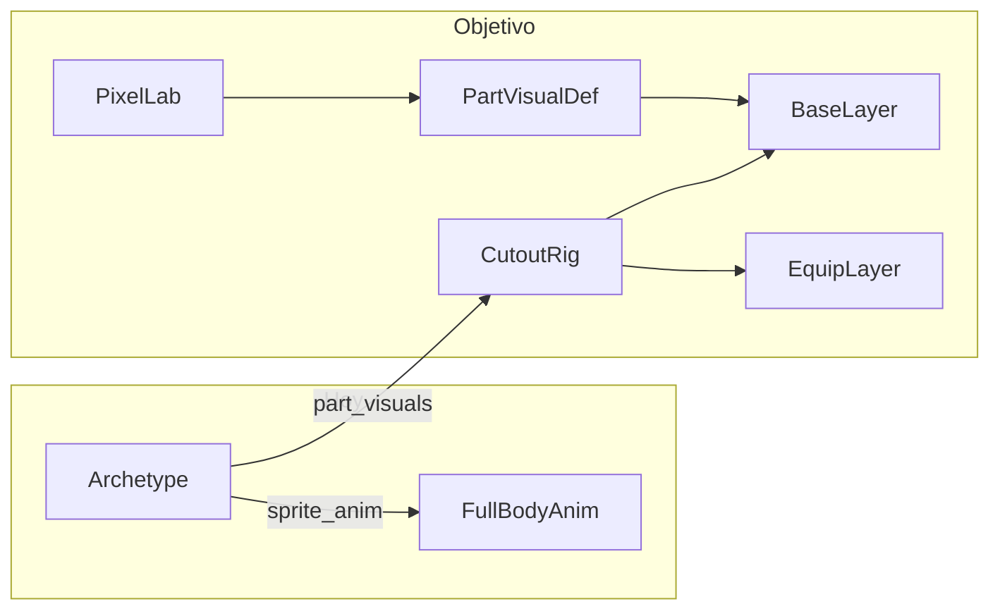

# Humanoide cutout modular (male, taparrabos)

## Estado actual

El diseño ya está en `[docs/GAME_DESIGN.md](docs/GAME_DESIGN.md)` §5.4–5.5: slots `Slot_<part>` con `BaseLayer` / `EquipmentLayer` / `InjuryLayer`, texturas por orientación en `PartVisualDef`.

**Lo que falta:**


| Área                                                                         | Estado                                                                                                                                                         |
| ---------------------------------------------------------------------------- | -------------------------------------------------------------------------------------------------------------------------------------------------------------- |
| `[NpcAppearanceController](modules/appearance/npc_appearance_controller.gd)` | Modo cutout **ignora** `PartVisualDef.textures` y siempre pinta placeholders; `set_orientation` / `set_moving` solo funcionan con `AnimatedSprite2D` full-body |
| `[PartVisualDef](modules/appearance/part_visual_def.gd)`                     | Solo idle estático (`textures`); no hay walk                                                                                                                   |
| `[humanoid.tres](assets/data/archetypes/humanoid.tres)`                      | Offsets/z_index de placeholders OK; sin PNGs                                                                                                                   |
| `[main_character.tres](assets/data/archetypes/main_character.tres)`          | Sigue en **modo A** (`human_male_sprite_anim.tres`)                                                                                                            |
| Equipo visual                                                                | Editor usa iconos como overlay (`set_equipment_texture`); falta `apply_equipment` con `EquipmentVisualDef`                                                     |





---

## Fase 1 — Código del rig cutout (bloqueante)

### 1.1 Extender `PartVisualDef`

Archivo: `[modules/appearance/part_visual_def.gd](modules/appearance/part_visual_def.gd)`

Añadir campos alineados con `[NpcSpriteAnimDef](modules/appearance/npc_sprite_anim_def.gd)`:

- `walk_textures: Dictionary` — strip por orientación (`front`, `back`, `side_left`, `side_right`)
- `walk_hframes: int = 5`
- `walk_fps: float = 8.0`
- Helper `build_sprite_frames_for_part() -> SpriteFrames` (idle 1 frame + loop walk por orientación)

Mantener `textures` como idle (no renombrar aún; documentar como idle en comentario).

### 1.2 Mapeo 8 vías → 4 vistas cutout

Archivo nuevo sugerido: `[modules/appearance/cutout_orientation.gd](modules/appearance/cutout_orientation.gd)` (o método estático en `Direction`)


| Orientación runtime (8)              | Vista cutout (4) | `flip_h`                                                      |
| ------------------------------------ | ---------------- | ------------------------------------------------------------- |
| `front`, `front_right`, `front_left` | `front`          | no                                                            |
| `back`, `back_right`, `back_left`    | `back`           | no                                                            |
| `side_right`                         | `side_right`     | no                                                            |
| `side_left`                          | `side_left`      | **sí** (reutiliza textura `side_right` si no hay `side_left`) |


El editor NPC ya usa 4 vistas (`[addons/uf_npc_editor/workspace.gd](addons/uf_npc_editor/workspace.gd)` L16); el jugador usa 8 (`[core/direction.gd](core/direction.gd)` `to_orientation`).

### 1.3 Actualizar `NpcAppearanceController`

Archivo: `[modules/appearance/npc_appearance_controller.gd](modules/appearance/npc_appearance_controller.gd)`

- `_build_slot`: si hay texturas reales → `AnimatedSprite2D` en `BaseLayer` con `SpriteFrames` del `PartVisualDef`; si no, fallback placeholder actual
- `set_orientation` / `set_moving`: rama cutout que refresca **todos** los slots (base + equipment + injury)
- `sync_from_instance`: aplicar orientación cutout + re-aplicar equipo/lesiones
- `apply_equipment(slot, visual, orientation)` según pseudocódigo en GAME_DESIGN §5.5.2 (hoy solo existe `set_equipment_texture`)
- Opcional v1: `feet_anchor` / offset global del rig (como `compute_placement_offset()` del sprite sheet) para alinear pies al tile

### 1.4 Cableado equipo

- `[modules/equipment/equipment.gd](modules/equipment/equipment.gd)` → `AppearanceModule` al equipar/desequipar
- Editor NPC: `_reapply_equipment_visuals()` debe usar `EquipmentVisualDef` vía `EquipmentModule.resolve_visual`, no solo icono

---

## Fase 2 — Pipeline PixelLab (taparrabos v1)

**Decisión tuya:** taparrabos primero; variante desnuda (`naked/`) en fase posterior reutilizando el mismo rig y offsets.

**Herramientas MCP** (ver `[mcps/user-pixellab/tools/](mcps/user-pixellab/tools/)`):


| Paso                 | Tool                                  | Notas                                                                                                                                            |
| -------------------- | ------------------------------------- | ------------------------------------------------------------------------------------------------------------------------------------------------ |
| Idle 4-dir por parte | `create_8_direction_object`           | `view: "low top-down"`, `size: 64`, coherente con `[HumanMaleIdle.png](assets/visuals/characters/human/male/HumanMaleIdle.png)`                  |
| Walk 4-dir por parte | `animate_object`                      | `mode: "v3"`, `directions: ["south","north","east","west"]`, `animation_description: "walking cycle"`, `frame_count: 8` (≈5 frames útiles + ref) |
| Coherencia           | `style_image_base64` / `style_images` | Ancla: `[preset_pixellab_01.png](assets/visuals/parts/portraits/humanoid/preset_pixellab_01.png)` o frame SE del idle actual                     |


**Convención PixelLab → juego:**


| PixelLab | Clave Godot                  |
| -------- | ---------------------------- |
| south    | `front`                      |
| north    | `back`                       |
| east     | `side_right`                 |
| west     | `side_left` (o flip de east) |


### 2.1 Orden de generación (6 partes)

Generar **en este orden** para encadenar estilo:

1. **body** (torso + taparrabos; sin cabeza/extremidades)
2. **head**
3. **arm_left**, **arm_right**
4. **leg_left**, **leg_right**

### 2.2 Prompts base (reutilizar en todas las partes)

Fragmento común en cada `description`:

> fantasy RPG male humanoid, low top-down isometric pixel art, lineless, basic shading, medium detail, muted earth tones, same character as style reference, transparent background, single isolated body part only

**Por parte** (añadir al fragmento común):


| Parte       | Añadir al prompt                                                       |
| ----------- | ---------------------------------------------------------------------- |
| `body`      | bare chest, simple leather loincloth, torso only, no head arms or legs |
| `head`      | head and neck stub, short dark hair, no torso                          |
| `arm_left`  | left arm detached, bare skin, open hand                                |
| `arm_right` | right arm detached, mirror of left                                     |
| `leg_left`  | left leg detached, bare foot                                           |
| `leg_right` | right leg detached, bare foot                                          |


**Parámetros recomendados:**

```text
create_8_direction_object(
  description = "<prompt de la tabla>",
  view = "low top-down",
  size = 64,
  style_image_base64 = <frame south del body, una vez exista>
)
```

Tras cada `object_id` completado (`get_object`):

```text
animate_object(
  object_id = <id>,
  mode = "v3",
  animation_description = "walking cycle, subtle arm swing",
  directions = ["south", "north", "east", "west"]
)
```

**Coste estimado:** ~6 objetos × (1 create + 1 animate 4-dir) ≈ 12 jobs; reservar créditos PixelLab antes de animar todo.

### 2.3 Export e importación

Layout propuesto (documentar en `assets/visuals/parts/human/male/README.md`):

```text
assets/visuals/parts/human/male/
  loincloth/
    body/front_idle.png, body/front_walk.png, body/back_idle.png, ...
    head/...
    arm_left/...
    arm_right/...
    leg_left/...
    leg_right/...
  defs/
    loincloth_body.tres ...   # PartVisualDef por parte
  README.md                   # job IDs PixelLab, prompts, offsets finales
```

Reglas import Godot: filtro **Nearest**, sin compresión lossy, `repeat` disabled.

**Post-proceso manual (Pixelorama/Aseprite):**

- Recortar márgenes transparentes si el canvas 64×64 deja mucho aire (mantener **mismo punto de anclaje** entre idle y walk de cada parte)
- Verificar que piernas/brazos no “floten” respecto al torso usando el preview del editor NPC

### 2.4 Ajuste de offsets

Partir de offsets actuales en `[humanoid.tres](assets/data/archetypes/humanoid.tres)`:


| Parte | offset inicial | z_index |
| ----- | -------------- | ------- |
| head  | (0, -22)       | 2       |
| arms  | (±13, -2)      | 1       |
| legs  | (±6, 22)       | 0       |
| body  | (0, 0)         | 0       |


Fine-tuning en `[uf_npc_editor](addons/uf_npc_editor/workspace.gd)` preview (4 orientaciones) hasta que el composite coincida con el full-body de referencia.

---

## Fase 3 — Assets y arquetipo

1. Crear 6 `PartVisualDef` en `assets/visuals/parts/human/male/defs/` (o reutilizar `[main_body.tres](assets/visuals/parts/main_body.tres)` etc. añadiendo texturas)
2. Actualizar `[humanoid.tres](assets/data/archetypes/humanoid.tres)`: `part_visuals` → referencias externas con PNGs cableados
3. **Quitar** `sprite_anim` de `[main_character.tres](assets/data/archetypes/main_character.tres)` y de `[human_factory.gd](modules/npc/_private/human_factory.gd)` (`build_male_sprite_anim`)
4. Mantener `[human_male_sprite_anim.tres](assets/visuals/characters/human/male/human_male_sprite_anim.tres)` como referencia visual legacy (no borrar aún)

---

## Fase 4 — Prueba de equipo (smoke test)

1. Crear un `EquipmentVisualDef` dummy (p. ej. casco simple) en `assets/visuals/equipment/` con 4 texturas
2. Enlazarlo a un `ItemDef` existente de slot `head`
3. Verificar en editor NPC + spawn en `[world_root](scenes/game/game_bootstrap.gd)`: equip → capa equipment visible; unequip → vuelve base taparrabos

---

## Fase 5 — Variante desnuda (después de v1)

1. Regenerar solo `body` + piernas (taparrabos → piel) con mismos `style_images` y **mismos offsets**
2. Segundo set de `PartVisualDef` bajo `assets/visuals/parts/human/male/naked/`
3. Selección vía trait/skin en arquetipo o instancia (decisión de datos pendiente; no bloquea v1)

---

## Documentación

- Ampliar `[docs/GAME_DESIGN.md](docs/GAME_DESIGN.md)` §5.5: idle+walk en cutout, mapeo 8→4, layout `assets/visuals/parts/human/`
- Crear regla `.cursor/rules/pixellab-character.mdc` (análoga a `[pixellab-art.mdc](.cursor/rules/pixellab-art.mdc)`) con constantes de personaje: `view=low top-down`, `size=64`, `lineless`, seed de personaje
- Actualizar `[docs/ROADMAP.md](docs/ROADMAP.md)`: marcar apariencia cutout humano male

---

## Verificación

1. `godot --headless --path . --script res://tools/validate_scripts.gd`
2. `godot --headless --path . --script res://tools/check_architecture.gd`
3. Editor NPC → arquetipo `humanoid` / `main_character`: 4 orientaciones, idle/walk, sin placeholders de color
4. Mundo: WASD con 8 orientaciones mapeadas correctamente
5. Equipar item de prueba con `EquipmentVisualDef`

---

## Qué necesito de ti durante la ejecución

Cuando pasemos a implementar/generar arte, iré pidiendo confirmación en estos puntos:

1. **Aprobación de créditos PixelLab** antes de lanzar los 6 `animate_object` (mostrar coste vía `get_object` / balance si hace falta)
2. **Revisión visual** del primer objeto (`body` idle 4-dir) antes de animar y antes de replicar estilo al resto de partes
3. **OK final de offsets** en preview del editor tras importar PNGs

El sprite sheet `[HumanMale*.png](assets/visuals/characters/human/male/)` seguirá como referencia de estilo hasta que el cutout lo sustituya visualmente.