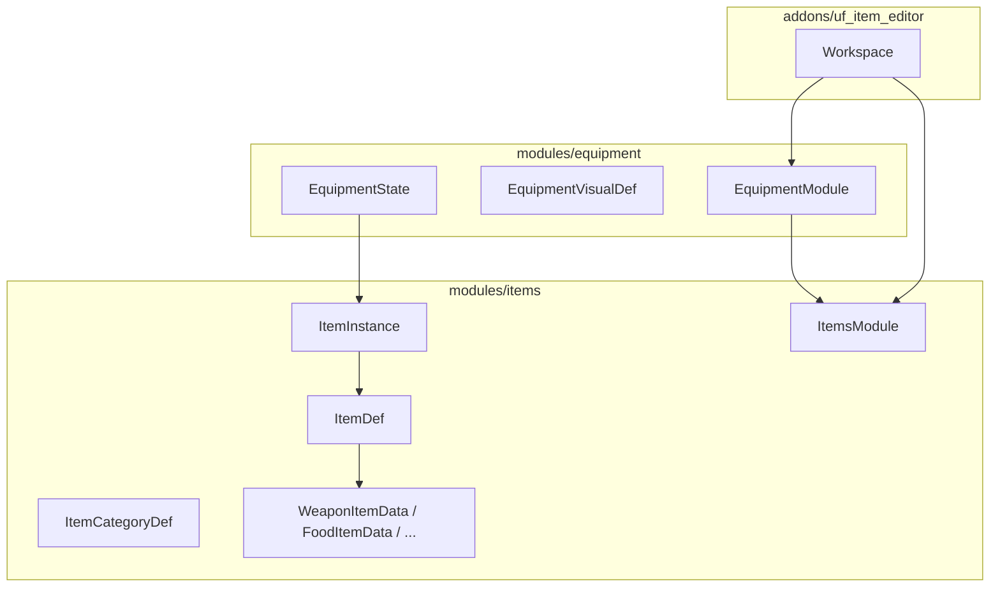

# Módulo de items + editor desacoplado

## Recomendación arquitectónica

**Nuevo módulo [`modules/items/`](modules/items/)** para el catálogo y las instancias. **`equipment` se estrecha** a slots, validación equipar/desequipar y visuales en rig — no debe ser el dueño de “pan” ni de quest items.

Motivos alineados con [`docs/ARCHITECTURE.md`](docs/ARCHITECTURE.md) y tu aclaración:
- Items no equipables (food, valuable, quest) comparten inventario/loot pero no `EquipmentSlotMap`.
- Propiedades por categoría exigen un esquema extensible, no un `ItemDef` monolítico de solo equipo.
- `ItemDef` hoy en [`modules/equipment/item_def.gd`](modules/equipment/item_def.gd) es demasiado limitado (7 campos, solo equipo).



---

## Modelo de datos (definición vs instancia)

### Capa definición — `ItemDef` (`.tres` inmutable en runtime)

Ubicación: [`assets/data/items/`](assets/data/items/) (mantiene convención de [`docs/GAME_DESIGN.md`](docs/GAME_DESIGN.md) §7).

| Campo | Propósito |
|-------|-----------|
| `id`, `display_name_key`, `description_key` | Identidad + localización |
| `category_id` | `weapon`, `food`, `valuable`, `armor`, `quest`… |
| `tags` | Clasificación libre: `sword`, `2handed`, `consumable`… |
| `icon` | Fallback UI |
| `sprite_ref` | Enlace al arte base (p. ej. `weapons/long_sword/type01`) |
| `inventory_size: Vector2i` | Huella en rejilla (3×2, 4×1) |
| `weight`, `base_price`, `max_durability` | Comunes; categoría decide cuáles aplican en UI |
| `state_tiers: Array[ItemStateTierDef]` | **Definición** de cada estado: sprite + multiplicadores |
| `quality_tiers: Array[ItemQualityTierDef]` | **Definición** de cada calidad: multiplicadores de stats/precio |
| `category_data: Resource` | Payload polimórfico según categoría |

**`ItemStateTierDef`** (nuevo Resource):
- `id` (`pristine`, `good`, `worn`, `rusty`, `battered` — alineado con [`assets/visuals/equipment/weapons/README.md`](assets/visuals/equipment/weapons/README.md))
- `display_name_key`
- `sprite_index: int` (columna en strip 320×64) o `icon_override`
- `stat_multiplier`, `price_multiplier`, `durability_multiplier`

**`ItemQualityTierDef`** (nuevo Resource):
- `id` (`common`, `uncommon`, `rare`, `epic`…)
- `display_name_key`
- `stat_multiplier`, `price_multiplier`
- `tint_color` opcional para UI

**Payloads por categoría** (v1):

| Resource | Campos clave | v1 |
|----------|--------------|-----|
| `WeaponItemData` | `weapon_family`, `design_type`, `slot`, `visual: EquipmentVisualDef`, `hands: 1\|2`, `attribute_modifier_id` | **Completo** |
| `FoodItemData` | `nutrition`, `spoilage_hours`, `stackable` | Esqueleto (campos export, sin UI completa) |
| `ValuableItemData` | `stackable`, `merchant_category` | Esqueleto |

**`ItemCategoryDef`** (`.tres` en `assets/data/item_categories/`):
- `id`, `display_name_key`
- `payload_script: Script` (tipo de `category_data`)
- `list_row_fields: Array[StringName]` — qué columnas muestra el editor en la lista central
- `default_state_tiers` / `default_quality_tiers` — plantillas al crear item nuevo

### Capa instancia — `ItemInstance` (runtime, nunca `.tres` compartido)

```gdscript
# Conceptual
def_id: StringName
state_index: int      # índice en ItemDef.state_tiers
quality_index: int    # índice en ItemDef.quality_tiers
modifier_ids: Array[StringName]  # enchanted, coated_oil — ModifierDef ajenos al ItemDef
durability: float     # opcional, deriva de max_durability × tier
count: int            # stacks (comida, monedas)
instance_uid: String  # único en inventario
```

Resolución de stats/icono (API pública `ItemsModule`):
```
effective_icon(instance) = state_tier.sprite from sprite_ref strip
effective_price(instance) = base_price × state_mult × quality_mult × modifiers
effective_stats(instance) = category_data.attribute_modifier + tiers + instance.modifier_ids via ModifierModule
```

Los **modificadores de instancia** reutilizan [`ModifierDef`](modules/modifier/modifier_def.gd) existente (`kind` nuevo opcional `ITEM` o tags `item_modifier`).

### Cambio en `equipment`

[`EquipmentState`](modules/equipment/equipment_state.gd) hoy guarda `slot → item_id`. **Migrar a `slot → ItemInstance`** (o `instance_uid` + bolsa de instancias).

- Equipar valida: `ItemDef.category_data` es equipable, `slot` compatible, `allows_archetype(tags)`.
- Inventario portable (`inventory` / `death_loot` de GAME_DESIGN §7) vive como `Array[ItemInstance]` en `EquipmentState` o en `InventoryState` separado dentro del mismo módulo — recomendación: **ampliar `EquipmentState`** con `_inventory: Array` y `_death_loot: Array` en la misma iteración que `ItemInstance`, para no fragmentar el dominio “qué lleva un NPC”.

[`EquipmentModule`](modules/equipment/equipment.gd) delega carga de definiciones a `ItemsModule`; conserva `compatible_items()`, `resolve_visual()`, `attribute_modifier_ids()` pero operando sobre instancias.

**Migración**: los 10 dummy `.tres` actuales se convierten a `ItemDef` nuevo formato con `category_id = armor` y `ArmorItemData` mínimo (o `equipment` genérico) para no romper [`uf_npc_editor`](addons/uf_npc_editor/workspace.gd).

---

## API pública `ItemsModule` (fachada RefCounted, log `ITM`)

Archivos previstos en [`modules/items/`](modules/items/):

| Archivo | Rol |
|---------|-----|
| `items.gd` | Fachada |
| `item_def.gd` | Definición (mover desde equipment) |
| `item_instance.gd` | Runtime |
| `item_state_tier_def.gd`, `item_quality_tier_def.gd` | Tiers |
| `item_category_def.gd` | Catálogo de categorías |
| `item_sprite_ref.gd` | Referencia a arte (`category/weapon_family/typeNN`) |
| `weapon_item_data.gd`, `food_item_data.gd`, `valuable_item_data.gd` | Payloads |
| `_private/item_catalog.gd` | Escaneo `assets/data/items/`, filtros |
| `_private/sprite_library.gd` | Escaneo `assets/visuals/equipment/weapons|shields|icons/` |

Funciones mínimas v1:
- `list_defs(filter: Dictionary) -> Array[ItemDef]`
- `load_def(id) -> ItemDef`
- `list_sprite_templates(category, family) -> Array` — entradas “crear desde cero”
- `list_categories() -> Array[ItemCategoryDef]`
- `create_instance(def_id, state_idx, quality_idx) -> ItemInstance`
- `resolve_icon(instance) -> Texture2D` — incluye helper strip (portar lógica de weapons README)
- `resolve_list_row(instance_or_def, preview_state, preview_quality) -> Dictionary` — datos para fila del editor
- `save_def(item: ItemDef) -> Error` — para el editor
- `duplicate_def(source: ItemDef) -> ItemDef` — clonar plantilla

---

## Editor `uf_item_editor` (filosofía NPC editor)

Estructura espejo de [`addons/uf_npc_editor/`](addons/uf_npc_editor/):
- [`plugin.gd`](addons/uf_npc_editor/plugin.gd) — main screen tab, lifecycle
- `workspace.gd` — UI programática 3 columnas
- `item_list_row.gd` — fila reutilizable (icono + campos + tags)

### Layout propuesto

```
┌─────────────────────────────────────────────────────────────────┐
│ Toolbar: Category ▼ | Save | Status                             │
├──────────────┬────────────────────────────┬─────────────────────┤
│ LEFT         │ CENTER                     │ RIGHT               │
│ Propiedades  │ Lista de seleccionables    │ Acciones + filtros  │
│ editables    │                            │                     │
│ del ItemDef  │ [Sprites] [Items creados]  │ [Nuevo][Clonar]     │
│ en edición   │                            │ [Editar][Borrar]    │
│              │ Cada fila:                 │                     │
│ Campos       │  [img] nombre, peso,       │ Filtros:            │
│ comunes +    │  precio, durabilidad,      │  quality ▼          │
│ payload      │  grid 3×2, tags,           │  state ▼            │
│ categoría    │  state label, quality      │  modifiers ▼        │
│              │  label, modifier tags      │  tags ▼             │
│ State tiers  │                            │ Preview state/qual  │
│ editor       │                            │ para filas          │
│ Quality tiers│                            │                     │
└──────────────┴────────────────────────────┴─────────────────────┘
```

**Flujos UX**:
1. **Nuevo desde sprite**: seleccionar fila en tab “Sprites” → `Nuevo` → `ItemDef` vacío con `sprite_ref` rellenado y tiers por defecto de categoría → editar izquierda → `Guardar`.
2. **Clonar item**: tab “Items creados” → seleccionar → `Clonar` → copia en memoria con `id` nuevo → editar → guardar.
3. **Editar**: carga `.tres` en panel izquierdo; lista central resalta selección.
4. **Distinguir modos**: filas “sprite” muestran solo arte + familia; filas “item” muestran campos completos del `ItemDef` (valores base, tiers[0] como preview o según filtros derecha).

**v1 funcional**: categoría `weapon` end-to-end (sprites `weapons/` + guardar `.tres`). Categorías `food` y `valuable` registradas en `ItemCategoryDef` con payload y filas de lista mínimas, pero formulario izquierdo reducido / placeholder.

**Preview opcional v1.1**: columna central inferior o modal con icono a tamaño grande según `state_index` seleccionado en panel derecho (sin rig NPC completo en v1).

---

## Integración con sistemas existentes

| Sistema | Cambio |
|---------|--------|
| [`uf_npc_editor`](addons/uf_npc_editor/workspace.gd) | Drag-drop crea `ItemInstance` default; equip usa instancia |
| [`UfItemSlot`](modules/gui/widgets/uf_item_slot.gd) | Payload evoluciona a `uf_item_instance` (uid + icon) sin importar `ItemDef` en gui |
| [`ModifierModule`](modules/modifier/modifier.gd) | Modificadores de instancia en `effective_stats` |
| [`tools/merge_weapon_states.gd`](tools/merge_weapon_states.gd) | Sin cambio; `sprite_ref` apunta al strip resultante |
| [`tools/check_architecture.gd`](tools/check_architecture.gd) | Añadir `uf_item_editor` a `_PRESENTATION_ROOTS`; matriz `equipment` → `items` |

---

## Documentación a actualizar

- [`docs/GAME_DESIGN.md`](docs/GAME_DESIGN.md) — §7 ampliado: `ItemInstance`, categorías, tiers, separación items/equipment
- [`docs/ARCHITECTURE.md`](docs/ARCHITECTURE.md) — fila módulo `items` (ITM), dependencia `equipment` → `items`, addon `uf_item_editor`
- [`venv.ini`](venv.ini) — `LOG_ITEMS_LEVEL=1`

---

## Fases de implementación

### Fase A — Dominio `items` (sin editor)
- Crear módulo y Resources
- Mover/adaptar `ItemDef` desde equipment
- `ItemsModule` con list/load/save/resolve_icon
- Categorías: `weapon` (completa), `food` + `valuable` (stub)
- Migrar dummy items + compat shim en `EquipmentModule.load_item()` → delega a `ItemsModule`

### Fase B — Instancias + equipment
- `ItemInstance` + `create_instance` / resolvers
- `EquipmentState` con instancias + inventario array
- Actualizar `uf_npc_editor` equip flow
- Evento futuro `inventory.item_added` en [`core/events.gd`](core/events.gd) (stub)

### Fase C — Editor v1
- Addon `uf_item_editor` main screen
- 3 columnas + `item_list_row.gd`
- CRUD + `ResourceSaver.save` + filesystem scan
- Tab sprites weapons + tab items creados
- Filtros derecha (state/quality/tags)

### Fase D — Categorías adicionales (post-v1)
- UI completa food/valuable/armor/quest
- Panel inventario in-game (`uf_inventory.tscn` faltante)
- Loot rules / death_loot

---

## Decisiones ya cerradas contigo

| Tema | Decisión |
|------|----------|
| Estado / calidad | Tiers definidos en `ItemDef`; índice elegido en `ItemInstance` |
| Modificadores | Solo en `ItemInstance`; referencian `ModifierDef` |
| No-equipo | Módulo `items` separado; `equipment` solo equipar |
| v1 categorías | Armas completas; food/valuable esqueleto |

## Riesgo principal

Migrar `EquipmentState` de `item_id` a `ItemInstance` toca NPC editor y cualquier código que asuma ids sueltos. Abordar en Fase B con shim temporal (`instance` con `quality_index=0`, `state_index=0`) para los dummies existentes.
