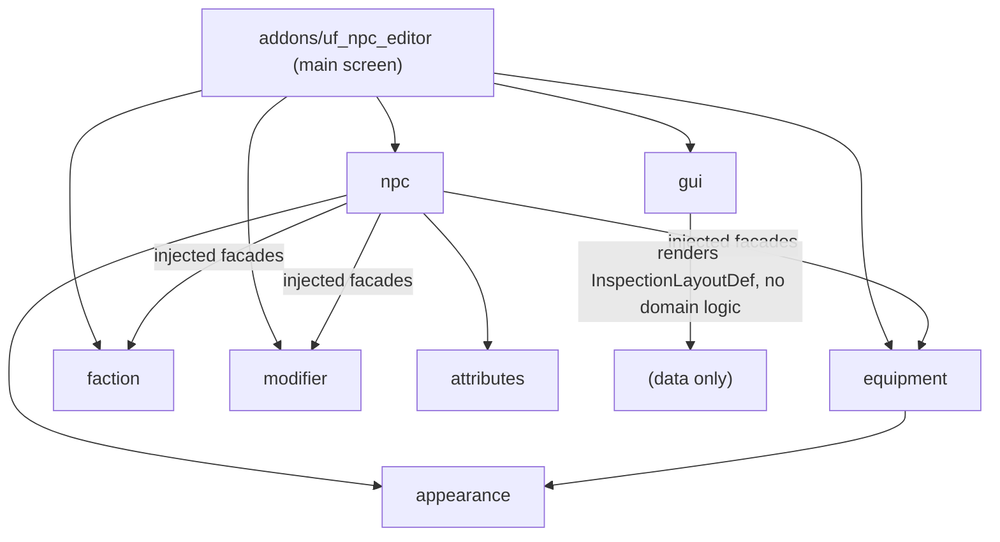
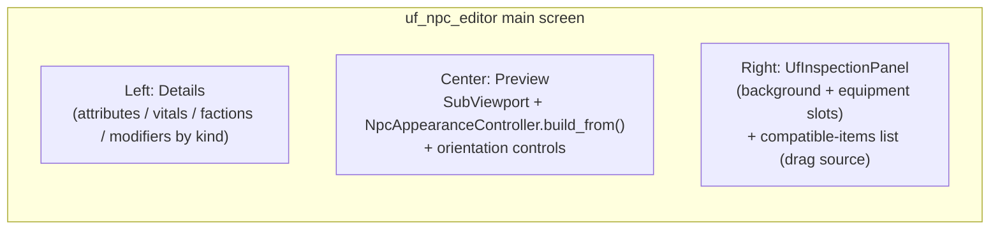

# NPC Editor — Foundations & Skeleton

## Decisions locked in

- Three separate concepts: **Archetype** (parent chain, already exists), **Faction** (group membership + granted modifiers + relations, e.g. `undead`), **Modifier** (stat/behavior deltas by `kind`: trait / malady / status / scaler, e.g. `elite`).
- Editor = **main-screen** `EditorPlugin` (`_has_main_screen()`), 3 columns.
- Scope = **foundations + skeleton**: real (minimal) module facades + Resources, editor loads real archetypes and previews the rig, GUI drag-drop works in-memory. Deep editing / full `.tres` save deferred.
- The inspection panel is **built now in the GUI module** and reusable in-game.

## Architecture (dependency flow, all downward/lateral via public facades)

Key principle: `npc` stays loosely coupled — it references factions/modifiers/items **by id** and receives sibling facades via **dependency injection** (setter), degrading gracefully when not injected. GUI stays purely presentational (renders a layout + emits signals; never imports `ItemDef`/`FactionDef`).

## New modules

### `modules/modifier/` (log `MOD`)

- `modifier_def.gd` — `class_name ModifierDef extends Resource`: `id`, `display_name_key`, `kind` (enum `TRAIT/MALADY/STATUS/SCALER`), attribute ops (additive + multiplicative per attribute name), `tags: Array[StringName]`.
- `modifier.gd` — `class_name ModifierModule`: `load_def(id)`, `list_defs()`, `apply(base: AttributeSet, defs) -> AttributeSet` (order: additive then multiplicative), `list_by_kind(kind)`.
- Assets: `assets/data/modifiers/`. `elite.tres` example (SCALER, +x% strength/vitality).

### `modules/faction/` (log `FAC`)

- `faction_def.gd` — `class_name FactionDef extends Resource`: `id`, `display_name_key`, `granted_modifier_ids: Array[StringName]`, `hostile_to`/`ally_to: Array[StringName]`, `tags`.
- `faction.gd` — `class_name FactionModule`: `load_def(id)`, `list_defs()`, `granted_modifiers(id)`, `relation(a,b)`.
- Assets: `assets/data/factions/`. `undead.tres` example (grants undead modifiers).

### `modules/equipment/` (log `EQP`)

- `item_def.gd` — `class_name ItemDef`: `id`, `display_name_key`, `slot: StringName`, `allowed_archetype_tags`, `icon: Texture2D`, `visual: EquipmentVisualDef`, `attribute_modifier_id` (optional).
- `equipment_visual_def.gd` — `class_name EquipmentVisualDef`: `slot`, `base_coverage` (none/partial/full), textures per orientation, `z_offset` (per GAME_DESIGN §5.5.4).
- `equipment_slot_map.gd` — `class_name EquipmentSlotMap`: `slots: Array[StringName]` (humanoid set from §7.1).
- `equipment_state.gd` — `class_name EquipmentState extends RefCounted`: `slot -> item_id` map, `equip/unequip/get`.
- `equipment.gd` — `class_name EquipmentModule`: `compatible_items(archetype_tags, slot) -> Array[ItemDef]`, `load_item(id)`, `resolve_visual(item_id)`.
- Assets: `assets/data/items/`, `assets/visuals/equipment/`. 1-2 sample items.

## Extend existing modules

### `appearance`

- New `inspection_layout_def.gd` — `class_name InspectionLayoutDef`: `background_texture`, `slots: Array` of `{slot_id, rect (normalized), size}`. Drives the GUI inspection panel per archetype (humanoid silhouette vs beast).
- `npc_appearance_controller.gd`: add `set_equipment_texture(part_id, tex)` / `clear_equipment_texture(part_id)` populating the existing `EquipmentLayer` (currently created but unused, see [modules/appearance/npc_appearance_controller.gd](modules/appearance/npc_appearance_controller.gd) L101-104).

### `npc`

- [modules/npc/npc_archetype.gd](modules/npc/npc_archetype.gd): add `@export equipment_slot_map: EquipmentSlotMap`, `@export inspection_layout: InspectionLayoutDef`, and chain resolvers `resolve_equipment_slot_map()`, `resolve_inspection_layout()`; add merged `resolve_factions()` / `resolve_default_modifiers()` (currently leaf-only, ids only — L17-18).
- [modules/npc/npc_instance_data.gd](modules/npc/npc_instance_data.gd): add `equipment: EquipmentState`, `modifier_ids: Array[StringName]`, and `effective_attributes()` computing `base -> faction-granted -> instance modifiers -> equipment` via injected `ModifierModule`.
- [modules/npc/npc.gd](modules/npc/npc.gd): add `set_facades(faction, modifier, equipment)` injection + `assemble(instance)` that resolves ids to defs. `spawn()` stays working when facades are absent.

## GUI module (reusable panel + slot widget)

- `modules/gui/uf_inspection_panel.gd` — `class_name UfInspectionPanel extends UfInfoPanel`: `build_from_layout(layout: InspectionLayoutDef)` creates a background `TextureRect` inside a `UfLayoutRegion` + one `UfEquipmentSlot` per layout slot. Signals: `slot_activated(slot_id)`, `item_dropped(slot_id, payload)`, `item_removed(slot_id)`. No domain types imported.
- `modules/gui/widgets/uf_equipment_slot.gd` — `class_name UfEquipmentSlot extends Panel`: square cell, shows an icon; implements `_get_drag_data` / `_can_drop_data` / `_drop_data` with an opaque payload dict; emits the panel signals. Mirrors the drag pattern in [addons/uf_gui_tools/palette_item.gd](addons/uf_gui_tools/palette_item.gd).
- Scenes/icons: `ui/panels/uf_inspection_panel.tscn`, `ui/widgets/uf_equipment_slot.tscn` (+ icons). Register in [modules/gui/gui.gd](modules/gui/gui.gd) (`_PANEL_SCRIPTS`, `WIDGET_SCENES`, palette).

## Editor plugin `addons/uf_npc_editor/`

Follows the `EditorPlugin` skeleton of [addons/uf_map_editor/plugin.gd](addons/uf_map_editor/plugin.gd) / [addons/uf_gui_tools/plugin.gd](addons/uf_gui_tools/plugin.gd) but as a **main screen**:

- `plugin.cfg`, `plugin.gd` (`@tool extends EditorPlugin`, `_has_main_screen() -> true`, `_get_plugin_name() -> "NPC"`, `_get_plugin_icon()`, `_make_visible()`), instantiates the module facades and injects them into `NpcModule`.
- `workspace.gd` root `HSplitContainer` with 3 columns:

- Top bar: archetype `OptionButton` (scans `assets/data/archetypes/*.tres`), faction/modifier pickers.
- Center preview reuses the runtime rig (single source of truth): `build_from(archetype)`, orientation buttons call `set_orientation`.
- Right column: `GuiModule` builds `UfInspectionPanel` from `archetype.resolve_inspection_layout()`; a compatible-items `UfList` (from `EquipmentModule.compatible_items`) is the drag source; on `item_dropped` the editor updates `EquipmentState` in-memory and calls `NpcAppearanceController.set_equipment_texture` so the preview updates live.
- Left column: read + simple in-memory edit of attributes/vitals; lists factions and modifiers grouped by `kind`.
- Save: **deferred** (a disabled/TODO "Save archetype" button; full `.tres` write is a follow-up task).

## Docs & config

- [docs/ARCHITECTURE.md](docs/ARCHITECTURE.md) §12 table: add `faction` (FAC), `equipment` (EQP), `modifier` (MOD), and `uf_npc_editor`.
- [docs/GAME_DESIGN.md](docs/GAME_DESIGN.md): reconcile the Archetype/Faction/Modifier model, document `InspectionLayoutDef` + `UfInspectionPanel`, mark editor row §11.4 as in-progress.
- `venv.ini`: add `LOG_FACTION_LEVEL`, `LOG_EQUIPMENT_LEVEL`, `LOG_MODIFIER_LEVEL`.
- [tools/validate_scripts.gd](tools/validate_scripts.gd): add all new scripts.
- Update [.cursor/rules/npc-entities.mdc](.cursor/rules/npc-entities.mdc) with the faction/modifier separation; note `project.godot` plugin enable.

## Out of scope (follow-up tasks)

- AI/behaviors from factions (only data hooks: relations, tags, granted modifiers now).
- Full archetype/item `.tres` authoring & save-back from the editor.
- Malady/status runtime effects, injuries visuals, in-game inventory drag wiring.

